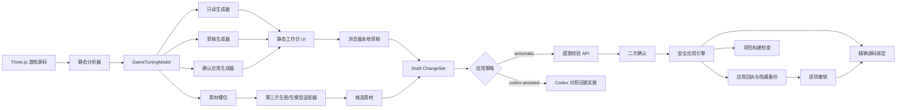
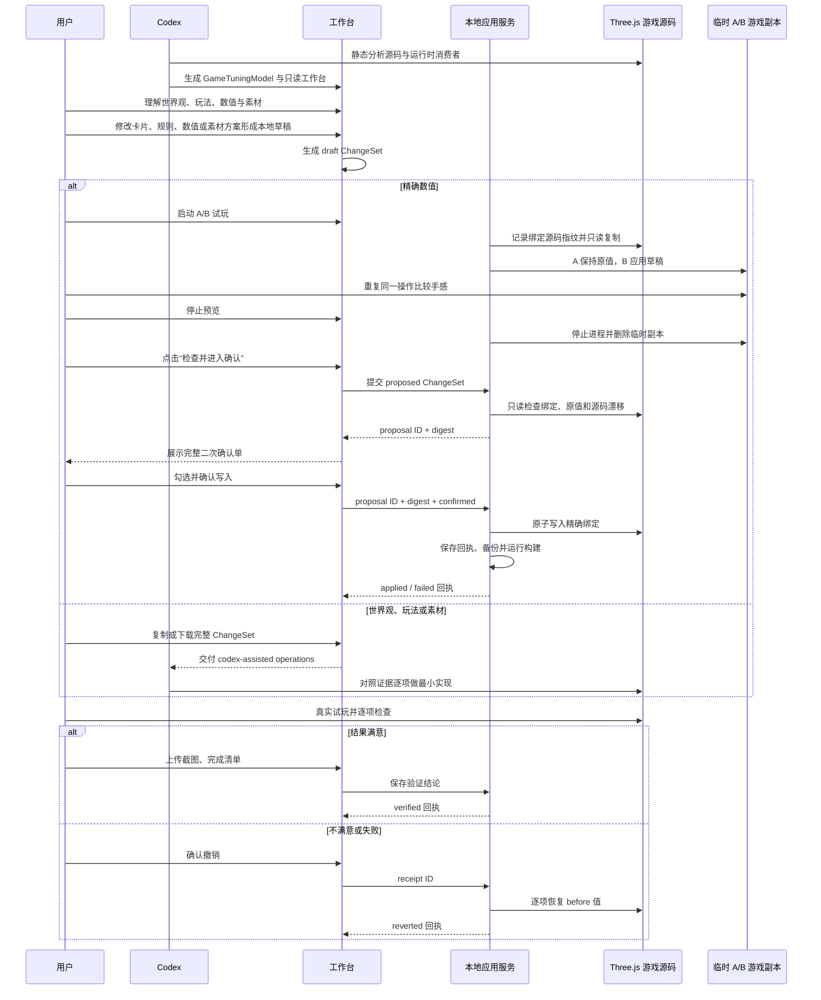

# Game Tuning Workbench 产品架构与方案

> 插件 ID：`game-tuning-workbench` ｜当前版本：`0.3.0` ｜当前引擎范围：仅支持 Three.js 网页游戏 ｜核心流程：`源码分析 → 只读理解 → 草稿调优 → A/B 真实试玩 / Codex 辅助实施 → 确认应用 → 验证或撤销`

## 1. 一句话说明

Game Tuning Workbench 是一个面向普通游戏爱好者的 Codex 插件：它把现有 Three.js 游戏源码转换成容易理解的“游戏调优工作台”，让用户看懂世界观、核心玩法、数值和素材，在不直接碰代码的情况下形成草稿，并通过明确确认、安全写入、验证和撤销来完成修改。

它不是另一个游戏引擎，也不是一套独立编辑器。它是位于 **游戏源码与非程序员之间的解释、调节和安全变更层**。

## 2. 产品要解决的问题

普通用户用 Codex 制作网页游戏时，常见困难有：

1. 不知道游戏的世界观和玩法到底写在了哪些代码里。
2. 看不懂 `walkSpeed = 5.7`、`attackCooldown = 1.4` 对玩家感受意味着什么。
3. 害怕修改一个参数后，意外影响其他系统。
4. 修改前看不到范围和风险，修改后也不知道是否真的生效。
5. 素材散落在文件、程序化生成代码和第三方生成服务中，缺少统一入口。

本产品把这些问题统一成一个工作流：

- 先解释当前游戏；
- 再形成浏览器本地草稿；
- 把草稿变成边界明确的 ChangeSet；
- 用户二次确认后才写入；
- 写入后构建、试玩，失败或不满意时只恢复记录中的值。

## 3. 目标用户与核心任务

### 3.1 目标用户

- 会描述游戏体验，但不会直接修改 JavaScript 的普通游戏爱好者；
- 使用 Codex 制作 Three.js 网页游戏的独立创作者；
- 希望快速做数值迭代、又担心破坏已有系统的非专业开发者。

### 3.2 用户最重要的任务

用户进入工作台后，应该能回答七个问题：

1. 这个游戏讲什么？
2. 玩家主要在做什么？
3. 哪些数值可以安全调节？
4. 调低或调高以后，玩家会感受到什么？
5. 这次修改会影响什么，又明确不会影响什么？
6. 原值和草稿值在真实游戏里分别是什么感受？
7. 应用后有哪些证据证明它正确，或者如何撤销？

## 4. 核心产品原则

### 4.1 证据优先

每个世界观卡片、玩法规则、数值参数和素材槽位都必须引用源码或运行时证据，并标记：

- `confirmed`：源码、配置、素材或用户确认能够直接证明；
- `inferred`：Codex 的合理推断，仍需用户或试玩确认；
- `missing`：项目尚未提供足够信息。

推断内容不能成为自动写入源码的依据。

### 4.2 一个控件，一个所有者，一个目标

每个可调参数必须具备：

- 稳定参数 ID；
- 唯一 `ownerId`；
- 唯一可编辑源码绑定；
- 一个真实运行时消费者；
- 安全范围和步进；
- 直接影响、已知间接影响和明确排除项。

同组参数不会因为“看起来相关”而自动联动。如果一个源码值天然控制多个玩家体验，应标记为耦合，而不是伪装成可独立调节。

### 4.3 草稿与源码分离

用户拖动滑杆时只修改浏览器本地草稿。草稿记录 `before` 和 `after`，不会直接改游戏文件。

### 4.4 二次确认

“查看确认单”和“真正写入源码”必须是两个独立动作。用户先看到完整操作和影响，再勾选确认声明，才允许应用。

### 4.5 局部撤销

撤销只执行记录中的 `after → before`，不会执行 Git reset，不会恢复整个文件覆盖其他改动。

## 5. 用户体验方案

### 5.1 七个工作区

| 工作区 | 用户看到什么 | 当前交互 |
| --- | --- | --- |
| 项目概览 | Three.js 版本、分析覆盖率、证据数量、已知限制 | 查看 |
| 世界观 | 图文设定、确认/推断状态、关联素材、源码依据 | 搜索、查看详情、单卡草稿 |
| 核心玩法 | 玩家循环、游戏反馈、奖励、风险、运行时规则 | 搜索、查看规则依据、单规则草稿 |
| 数值调优 | 普通语言参数、原值、草稿值、安全范围、影响边界 | 筛选、搜索、滑杆、精确输入、撤销 |
| A/B 试玩 | A 原值实例、B 草稿实例、源码未写入状态 | 启动、切换、更新草稿、停止并清理 |
| 素材库 | 素材槽位、来源、用途、技术约束、程序化占位 | 搜索、预览、生成方案草稿 |
| 验证与撤销 | 应用历史、试玩清单、截图、备注、验证状态 | 保存进度、通过、失败、删除证据、撤销 |

### 5.2 三种工作台模式

三个模式使用同一套模型和 UI 模板，通过 `workbench-meta.json` 的 `mode` 切换能力。

| 模式 | 用途 | 是否能改草稿 | 是否能写源码 |
| --- | --- | --- | --- |
| `readonly` | 先理解项目和证据 | 否 | 否 |
| `draft` | 浏览器本地调节和 ChangeSet 预览 | 是 | 否 |
| `apply` | 检查提案、二次确认、应用和撤销 | 是 | 默认锁定；显式授权后可以 |

`apply` 模式默认仍是安全预览：可以校验源码并打开二次确认单，但写入按钮锁定。只有本地服务以精确项目根目录启动后，才获得源码写权限。

## 6. 总体架构



## 7. 分层说明

### 7.1 分析层

入口：`scripts/analyze-three-project.mjs`

职责：

- 判断项目是否使用 Three.js；
- 扫描入口文件、运行时目录、配置、素材和消费者；
- 提取显式可调参数；
- 生成证据、限制和覆盖率报告；
- 输出统一的 `GameTuningModel`。

分析器只做第一遍静态分析。它不会把“看起来像参数”的任意数字都暴露给用户；没有运行时消费者的值不属于可调参数。

### 7.2 模型层

核心契约：`schemas/game-tuning-model.schema.json`

`GameTuningModel` 是整个产品的单一事实来源，主要包含：

- 项目和 Three.js 信息；
- 世界观卡片；
- 核心玩法循环和规则；
- 数值参数；
- 素材槽位；
- 证据；
- 依赖关系；
- 已知限制。

所有工作台模式都读取同一模型，避免只读页、草稿页和应用页各自维护不同的数据定义。

### 7.3 展示与交互层

主要文件：

- `assets/workbench/index.html`
- `assets/workbench/styles.css`
- `assets/workbench/app.js`
- `assets/workbench/draft-model.js`

当前采用无框架、无第三方运行时依赖的静态 HTML/CSS/JavaScript，原因是：

- 生成后的工作台可直接复制和预览；
- 不要求目标游戏安装 React 或额外依赖；
- 插件可以嵌入不同构建体系的 Three.js 项目；
- 减少工作台自身依赖对游戏项目的污染。

浏览器本地草稿按 `modelId` 存入 localStorage。加载时会检查草稿的 `before` 是否仍等于模型当前值；过期草稿会被忽略。

### 7.4 ChangeSet 层

核心契约：`schemas/change-set.schema.json`

ChangeSet 是用户意图与源码修改之间的边界。`0.2.0` 起，每个 operation 还必须声明应用策略：

- `automatic + local-apply-engine`：仅用于精确可写的有限数值绑定；
- `codex-assisted + codex`：用于世界观、玩法规则和素材等需要理解源码语义的变更。

两种策略可以出现在完整导出清单中，但不会进入同一次本地自动写入。状态包括：

```text
draft → proposed → applied → verified
                      └────→ failed
applied / failed → reverted
```

每个操作必须记录：

- 操作 ID；
- 操作类型；
- 目标 ID；
- 源码绑定；
- `before`；
- `after`；
- 修改原因。

影响区必须记录：

- 预期直接影响；
- 依赖目标；
- 明确排除项；
- 尚未解决的警告。

### 7.5 本地确认与应用服务

入口：`scripts/serve-workbench.mjs`

服务同时承担两类职责：

1. 提供静态工作台文件；
2. 在 `apply` 模式下提供本机 API。

API：

| 方法 | 路径 | 作用 |
| --- | --- | --- |
| `GET` | `/api/status` | 返回模式、确认预览和写权限状态 |
| `GET` | `/api/preview/status` | 返回 A/B 临时运行会话和源码指纹状态 |
| `POST` | `/api/preview/start` | 从同一草稿启动 A 原值、B 草稿两个真实游戏副本 |
| `POST` | `/api/preview/stop` | 停止两个游戏进程并删除临时副本 |
| `POST` | `/api/changesets/propose` | 校验提案并返回短期 proposal ID 与摘要指纹 |
| `POST` | `/api/changesets/apply` | 二次确认后执行精确写入 |
| `POST` | `/api/changesets/revert` | 按应用回执逐项恢复原值 |
| `GET` | `/api/receipts` | 列出持久化应用记录和验证状态 |
| `GET` | `/api/receipts/:id` | 读取单条应用记录 |
| `POST` | `/api/receipts/:id/verification` | 保存试玩清单、备注和验证结论 |
| `POST` | `/api/receipts/:id/evidence` | 添加截图证据 |
| `GET/DELETE` | `/api/receipts/:id/evidence/:evidenceId` | 查看或删除指定截图证据 |

服务只允许写权限模式绑定在 `127.0.0.1`、`localhost` 或 `::1`。

### 7.6 安全自动应用引擎

入口：`scripts/apply-engine.mjs`

本地引擎只支持形如以下结构的有限数字配置，并会主动拒绝 `codex-assisted` 操作：

```text
DEFAULT_TUNING.player.walkSpeed
ROOT.group.field + file + lineHint + access: editable
```

写入前会依次检查：

1. ChangeSet 与当前模型 ID 一致；
2. 目标参数存在且为 `confirmed`；
3. 源码绑定与模型完全一致；
4. `before` 等于模型当前值；
5. `after` 位于安全范围并符合步进；
6. 项目根目录与模型根目录完全一致；
7. 文件没有逃出根目录或通过符号链接逃逸；
8. 指定行仍位于预期对象分组；
9. 指定行的数字仍等于 `before`。

任意一项失败都会停止应用，不会猜测新的代码位置。

全部文件会先完成预检查，再通过同目录临时文件原子替换。如果多文件写入中途失败，已写入文件会恢复到本轮操作前的内容。

### 7.7 回执、备份与验证

应用后会在生成工作台的隐藏目录 `.gtw-history/` 中保存：

- 应用回执；
- ChangeSet；
- 影响文件的原始证据；
- 写入前后哈希；
- 构建检查命令、状态和输出；
- 自动生成的预期效果与排除项试玩清单；
- PNG、JPEG 或 WebP 截图证据和说明；
- 试玩备注、逐项结果与最终验证结论；
- 撤销状态。

HTTP 服务明确禁止访问隐藏目录。

构建通过只表示代码能够构建，不表示游戏手感正确。应用记录保持为 `applied`，直到所有试玩检查通过、构建未失败且至少附有一张截图后，用户才能把它标记为 `verified`。验证失败和已验证记录都保留精确撤销路径。

### 7.8 非持久化 A/B 运行时预览

入口：`scripts/runtime-preview-service.mjs`

工作台在应用源码前可以启动两个真实游戏实例：

- A：复制当前项目并保持原始参数；
- B：复制当前项目，只在临时副本内应用草稿参数；
- 两个实例使用不同的本机回环端口；
- `node_modules` 在存在时通过符号链接复用，不复制依赖；
- `.git`、`dist`、`node_modules` 和工作台历史不会进入临时副本；
- 启动前记录所有目标源码文件的哈希，运行中可重新确认真实源码未变化；
- 停止预览或关闭工作台服务时，两个子进程和系统临时目录都会清理。

该方案要求目标项目存在 `package.json` 和 `dev` 或 `start` 脚本。B 是启动时草稿的冻结快照；草稿再次变化后，需要点击“更新草稿预览”重建会话。它是真实 Three.js 运行实例，但不是对原进程做热注入。

### 7.9 素材 Provider 适配层

契约：`contracts/asset-provider.ts`

当前只定义统一接口，不绑定具体供应商。适配器未来负责：

- 声明支持生图、图片编辑或 3D 模型生成；
- 校验素材槽位约束；
- 提交异步任务并轮询状态；
- 返回统一的候选素材；
- 保留 Provider 任务 ID，但不暴露凭据。

Provider 不能直接修改游戏。生成结果先成为候选素材，再通过独立的 `replace-asset` ChangeSet 应用。

### 7.10 世界观、玩法与素材 ChangeSet

工作台允许三类语义草稿各自使用一个稳定 target ID：

- `edit-worldview` 记录单张卡片的标题、正文 `before/after`；
- `edit-gameplay` 记录单条规则的触发、条件、结果和玩家反馈；
- `replace-asset` 记录单个素材槽位、provider-neutral 生成请求、技术约束和候选选择状态。

它们默认是 `codex-assisted`。只读源码绑定只告诉 Codex 去哪里调查，不代表可以对该位置做字符串替换。素材的 `selectedOutput` 为 `null` 时只生成候选简报，不能覆盖现有文件。

完整 ChangeSet 可从工作台复制或下载。Codex 实施时必须逐项核对证据、只修改命名目标、报告文件差异，并重新生成模型，避免旧浏览器草稿挂在过期快照上。

## 8. “修改 A 不影响 B”如何实现

这是产品最关键的设计约束，不依赖一句提示词，而是通过多层结构共同保证。

### 8.1 模型层

- A 和 B 有不同稳定 ID；
- 每个参数只有一个 owner；
- 每个参数只有一个源码绑定；
- `effects.excluded` 明确记录必须保持不变的系统。

### 8.2 草稿层

- 每张世界观卡片、规则、参数或素材槽位只写一个 `targetId`；
- 同组参数、关联素材和相邻规则不会自动同步；
- 单项撤销只删除该目标草稿。

### 8.3 ChangeSet 层

- 每个 operation 独立记录 `before/after` 和应用策略；
- 已知依赖只进入影响清单，不自动变成额外修改；
- 用户确认前能看到所有实际操作。

### 8.4 应用层

- 只自动替换绑定行中的数字字面量；
- 世界观、规则和素材不会混入数值自动写入；
- 目标行或原值漂移就停止；
- 不做全局搜索替换；
- 不覆盖整个文件。

### 8.5 撤销层

- 只执行已记录 operation 的 `after → before`；
- 撤销前再次检查当前值等于 `after`；
- 其他用户修改会被保留。

## 9. 完整产品流程



## 10. 目录结构

```text
game-tuning-workbench/
├── .codex-plugin/
│   └── plugin.json                 # 插件元数据与入口
├── assets/workbench/
│   ├── index.html                  # 工作台页面骨架
│   ├── styles.css                  # 视觉和响应式样式
│   ├── app.js                      # 七视图、A/B 试玩、确认、验证和回执 UI
│   └── draft-model.js              # 数值归一化与四类 ChangeSet 生成
├── contracts/
│   └── asset-provider.ts           # 第三方素材服务适配接口
├── schemas/
│   ├── game-tuning-model.schema.json
│   ├── change-set.schema.json
│   └── asset-generation-request.schema.json
├── scripts/
│   ├── analyze-three-project.mjs   # Three.js 项目分析器
│   ├── generate-readonly-workbench.mjs
│   ├── generate-draft-workbench.mjs
│   ├── generate-apply-workbench.mjs
│   ├── serve-workbench.mjs         # 静态服务和本机 API
│   ├── apply-engine.mjs            # 安全写入与撤销引擎
│   ├── runtime-preview-service.mjs # 临时双副本 A/B 运行服务
│   └── validate-contracts.mjs
├── skills/game-tuning-workbench/   # Codex 工作流和安全规范
├── README.md / CHANGELOG.md        # 安装、升级和版本记录
├── examples/                       # 示例模型、ChangeSet 和真实分析结果
├── dist/                           # 可安装 marketplace 正式分发包
└── tests/                          # 分析、生成、应用和 API 集成测试
```

## 11. 当前使用方式

### 11.1 分析 Three.js 项目

```bash
node scripts/analyze-three-project.mjs <project-root> \
  --output <game-tuning-model.json> \
  --report <coverage-report.md>
```

### 11.2 生成三种工作台

```bash
node scripts/generate-readonly-workbench.mjs <model.json> --output <readonly-dir>
node scripts/generate-draft-workbench.mjs <model.json> --output <draft-dir>
node scripts/generate-apply-workbench.mjs <model.json> --output <apply-dir>
```

### 11.3 安全预览确认流程

```bash
node scripts/serve-workbench.mjs <apply-dir> --host 127.0.0.1 --port 4179
```

此时可以查看和校验二次确认单，但不能写源码。

### 11.4 为精确项目开启写入

```bash
node scripts/serve-workbench.mjs <apply-dir> \
  --host 127.0.0.1 \
  --port 4179 \
  --allow-source-write <exact-project-root>
```

只有模型根目录、命令中的根目录和源码实际路径完全匹配时，服务才会启动写权限。

## 12. 当前已经完成

- Codex 插件骨架和 `game-tuning-workbench` Skill；
- Three.js 项目识别和静态分析器；
- `GameTuningModel`、ChangeSet 和素材请求 Schema；
- 世界观、核心玩法、数值和素材的只读工作台；
- 浏览器本地草稿、搜索、分组、精确输入和单项/全部撤销；
- draft ChangeSet 预览；
- 世界观卡片、玩法规则和素材槽位的独立草稿；
- `edit-worldview`、`edit-gameplay`、`replace-asset` 语义 ChangeSet；
- 每项操作显式区分 `automatic` 与 `codex-assisted`；
- 完整 ChangeSet 复制与下载，语义操作与数值自动应用隔离；
- 安全确认预览；
- 短期 proposal ID 和摘要指纹；
- 精确根目录授权、源码漂移检查和原子写入；
- 构建结果、隐藏备份和应用回执；
- 持久化应用历史列表和单条记录详情；
- 根据直接影响与排除项自动生成试玩清单；
- 截图证据上传、查看、删除和验证备注；
- 只有清单全通过且存在截图时才能进入 `verified`；
- 保留无关修改的逐项撤销；
- 已验证记录仍可按 ChangeSet 精确撤销；
- 基于系统临时双副本的真实 Three.js A/B 试玩；
- A 使用当前参数、B 使用草稿参数，退出时删除临时副本；
- 运行前后目标源码指纹检查，预览不写真实项目；
- 第三方生图/生模型的统一适配接口；
- 可安装 marketplace 目录、校验和、版本记录与升级说明；
- 15 项自动化测试、应用/证据/验证/撤销 API 集成测试和 A/B 运行时集成测试。

## 13. 当前边界与未完成能力

### 13.1 A/B 预览目前采用重启式临时副本

当前已经运行真实 A/B 游戏实例，但 B 是启动会话时的草稿快照。移动滑杆后需要点击“更新草稿预览”，暂未做到同一运行进程内毫秒级热注入。

### 13.2 试玩验证管理已完成，自动执行尚未完成

工作台已经能管理历史、试玩清单、截图、备注、通过/失败结论和撤销。但仍需要用户手动完成游戏操作并上传截图；尚未自动定位关卡、执行固定输入、采集控制台或自动截图。

### 13.3 本地自动写入只支持有限数字配置

第一版只支持带精确行号的 `ROOT.group.field` 数字字面量。以下内容尚未自动应用：

- 字符串、布尔和枚举；
- 公式或表达式；
- 分散在多个函数中的耦合参数；
- 世界观、玩法规则和素材已经能生成 Codex 辅助 ChangeSet，但尚不支持本地无判断自动写入；
- AST 级复杂 JavaScript/TypeScript 修改。

### 13.4 素材服务尚未选型

已经有 Provider 接口、生成简报 UI 和 `replace-asset` 草稿，但尚未接入具体生图或生模型服务，也没有完成候选素材对比、输出元数据校验和确认替换。

### 13.5 仅支持 Three.js

当前会拒绝 Phaser、Babylon.js、Unity WebGL 等非 Three.js 项目。

## 14. 建议后续路线

### P0：自动化试玩证据

- 为参数绑定可重复执行的试玩场景和固定输入；
- 自动收集浏览器控制台、关键数值和截图；
- 将自动证据与用户手动判断分开显示；
- 对排除项增加可执行断言。

### P1：运行时热更新适配器

- 为支持的项目生成可选 preview adapter；
- 通过 `postMessage` 或本地通道把新草稿实时发送给 B 实例；
- 标记参数是立即生效、下一回合生效还是必须重开；
- 保留当前临时副本方案作为无侵入回退路径。

### P2：接入首批素材 Provider

- 选择首批图片和 3D 模型 Provider；
- 实现任务提交、进度、候选结果和重试；
- 校验尺寸、透明通道、格式、动画和多边形预算；
- 把已经生成的 `replace-asset` ChangeSet 接到候选输出与确认替换。

### P3：扩展可应用目标

- 引入 JavaScript/TypeScript AST 绑定；
- 支持布尔、枚举、文本和结构化玩法规则；
- 对耦合字段生成组合 ChangeSet 和警告；
- 增加更多 Three.js 项目结构样本。

### P4：公开分发准备

- 补充发布者信息、许可证、隐私说明和公开仓库地址；
- 增加真实 Three.js 项目回归集；
- 在干净用户环境继续验证安装、升级和版本迁移；
- 再评估是否扩展其他网页游戏引擎。

## 15. 产品验收标准

一个完整调优任务只有同时满足以下条件才能算完成：

1. 用户看懂参数的普通语言含义；
2. 参数具备真实源码声明和运行时消费者；
3. 草稿没有直接修改源码；
4. ChangeSet 列出了所有实际操作、直接影响和排除项；
5. 用户完成二次确认；
6. 写入前源码仍匹配 `before`；
7. 应用过程留下回执和可用撤销路径；
8. 项目构建通过；
9. 真实浏览器试玩证明目标行为改变；
10. 排除项在试玩中保持不变；
11. 不满意时能够只恢复本次记录值。

在第 9、10 项完成前，只能称为“已应用”，不能称为“已验证”。

## 16. 最重要的产品判断

这个产品的价值不只是把数字做成滑杆。真正的核心是：

> 把用户意图转换成有证据、有边界、可确认、可验证、可撤销的局部游戏变更。

只读工作台解决“看懂”，草稿层和 A/B 真实试玩解决“敢试”，确认应用层解决“敢改”，验证/撤销工作台解决“知道真的改对了，并且随时回得去”。
